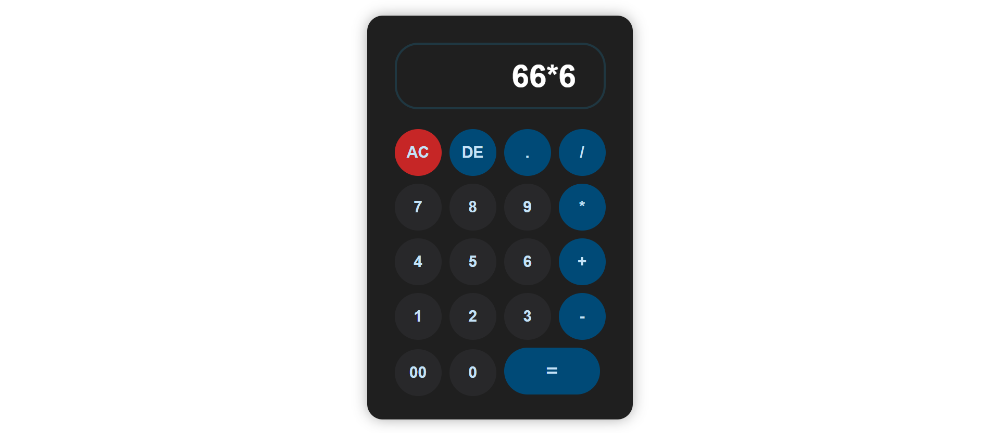

# React Calculator App.

### Live Demo: https://adilarain00.github.io/React-Calculator-App/

### Description

This project showcases a responsive calculator app, designed with vibrant color combinations and smooth functionality. Crafted in React with well-structured code, the app is visually appealing and works perfectly on all devices.

### Functionality

Built with React, it handles essential operations like addition, subtraction, multiplication, and division, with well-structured code for easy scalability.
